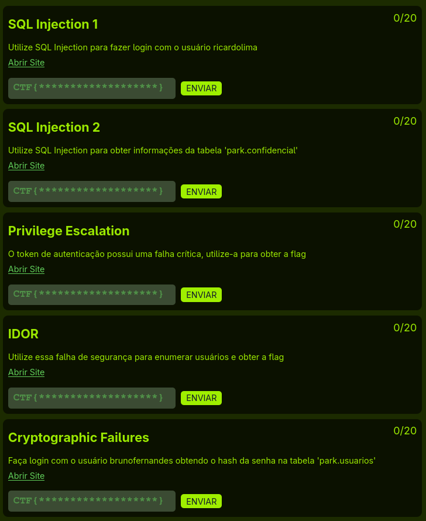

## Crescer CTF

### Requisitos
- Docker
- Docker Compose
- DBeaver ou outro Postgres Client para rodar o **scripts.sql**

### Instalação
```bash
docker-compose up
bash run.sh # Ou rodar o script pelo Postgres Client
```

### Acessar banco
- IP: 172.35.35.100
- User: postgres
- Senha: Postgres123

### Acessar site
- http://localhost:8080/ (Local)
- http://172.35.35.10:8080/ (Container)

### Lista de desafios



1. <s>**SQL Injection 1:**</s> Utilize SQL Injection para fazer login com o usuário ricardolima.

2. <s>**SQL Injection 2:**</s> Utilize SQL Injection para obter informações da tabela 'park.confidencial'.

3. <s>**Privilege Escalation:**</s> O token de autenticação possui uma falha crítica, utilize-a para obter a flag.

4. <s>**IDOR:**</s> Utilize essa falha de segurança para enumerar usuários e obter a flag.

5. <s>**Cryptographic Failures:**</s> Faça login com o usuário brunofernandes obtendo o hash da senha na tabela 'park.usuarios'.

6. **Local File Inclusion (LFI)** - Pendente
7. **XSS** - Pendente
8. **Path Traversal** - Pendente
9. **CSRF** - Pendente
10. **File Upload** - Pendente
11. **XXE** - Pendente
12. **Insecure Desserialization** - Pendente